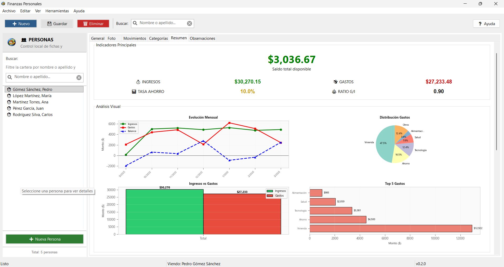

# Finanzas Personales

Aplicacion de escritorio offline para administrar personas, ingresos, gastos y analisis financiero desde una interfaz clasica, clara y lista para uso local.



Vista real del panel de resumen financiero. La aplicacion muestra saldo disponible, ingresos, gastos, tasa de ahorro y graficos de evolucion para analizar rapidamente la situacion financiera de cada persona.

## Que es

`Finanzas Personales` combina gestion administrativa y analisis visual en una sola app de escritorio:

- administra fichas de personas con datos generales, foto y observaciones;
- registra ingresos y gastos por categoria;
- calcula indicadores financieros utiles;
- muestra comparativas, alertas y graficos sin depender de internet;
- guarda todo localmente con `SQLite`.

## Por que destaca

- Es una aplicacion `offline-first`: no necesita backend, servidor ni suscripciones.
- Tiene una UI de escritorio tradicional, comoda para uso administrativo.
- Organiza el codigo por capas para que tambien sirva como proyecto de estudio.
- Incluye herramientas de diagnostico, datos demo y empaquetado.
- Ya cuenta con instalador MSI para Windows.

## Lo que puedes hacer

- Crear y editar personas con informacion de contacto y notas.
- Registrar movimientos financieros de ingreso o gasto.
- Analizar saldos, ratios, ahorro y distribucion de gastos.
- Revisar comportamiento mensual con graficos integrados.
- Exportar informacion y mantener evidencia local del estado financiero.

## Inicio rapido

### Windows

```bat
finanzas_personales\run.bat
```

### Linux / macOS

```bash
./finanzas_personales/run.sh
```

### Python puro

```bash
python finanzas_personales/run.py
```

El lanzador crea el entorno virtual si hace falta, instala dependencias, inicializa la base de datos y abre la aplicacion.

## Instalador

El flujo de instalacion ya soporta branding desde el logo principal y genera iconos derivados automaticamente.

### Construir assets de marca

```bash
python finanzas_personales/tools/generate_brand_assets.py
```

### Construir ejecutable o instalador

```bash
python finanzas_personales/tools/setup_installer.py build
python finanzas_personales/tools/setup_installer.py bdist_msi
python finanzas_personales/tools/setup_installer.py bdist_dmg
```

La guia detallada esta en [finanzas_personales/docs/INSTALADOR.md](finanzas_personales/docs/INSTALADOR.md).

## Arquitectura

El proyecto sigue una separacion por capas para que la logica sea mantenible y estudiable:

1. `domain`: entidades y reglas de negocio.
2. `application`: servicios y casos de uso.
3. `infrastructure`: SQLite, repositorios, exportacion y adaptadores.
4. `presentation`: vistas, presenters y coordinacion de la UI.
5. `shared`: configuracion y utilidades transversales.

## Estructura del proyecto

```text
Finanzas personales/
|-- README.md
|-- finanzas_personales/
|   |-- assets/
|   |-- docs/
|   |-- src/
|   |-- tests/
|   |-- tools/
|   |-- run.bat
|   |-- run.py
|   |-- run.sh
|   |-- pyproject.toml
|   |-- requirements.txt
|   `-- LICENSE
`-- docs/
```

## Documentacion adicional

- [Guia de instalacion](finanzas_personales/docs/INSTALACION.md)
- [Construccion del instalador](finanzas_personales/docs/INSTALADOR.md)
- [Guia para principiantes](finanzas_personales/docs/GUIA_PRINCIPIANTES.md)
- [Arquitectura](finanzas_personales/docs/arquitectura.md)
- [Modelo de datos](finanzas_personales/docs/modelo_de_datos.md)
- [Auditoria tecnica](finanzas_personales/docs/AUDITORIA_ACTUALIZADA.md)

## Pruebas

```bash
python -m unittest discover -s finanzas_personales/tests -p "test_*.py" -v
```

## Licencia

Distribuido bajo licencia [MIT](finanzas_personales/LICENSE).
